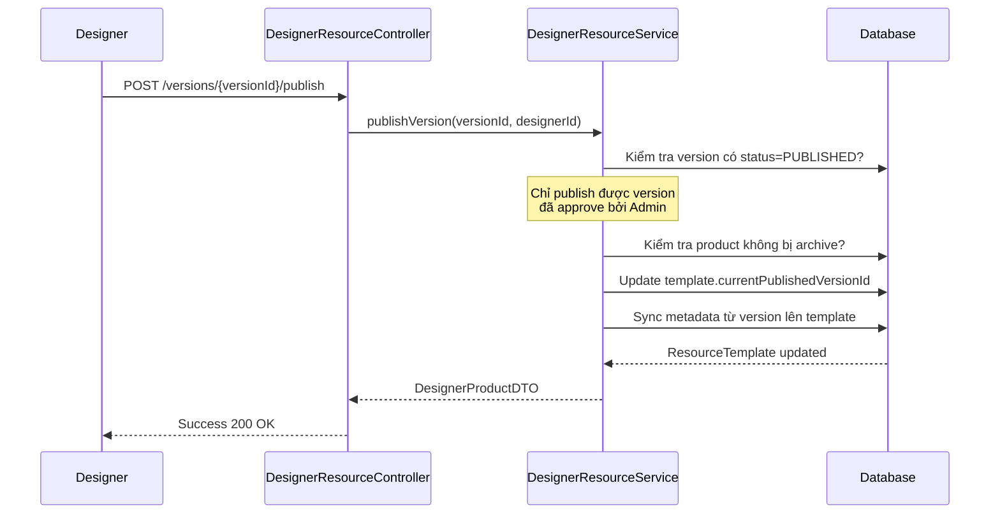

# Bug Fixes & Improvements - Designer Resource Management

## 📅 Ngày thực hiện: 2025-12-07

---

## 🎯 Tổng Quan

Document này tóm tắt các bug đã fix và chức năng đã thêm vào hệ thống quản lý sản phẩm Designer.

### ✅ Các Thay Đổi Đã Thực Hiện

1. ✅ **Fix Bug Critical:** Filter `isArchived` trong Customer queries
2. ✅ **Thêm Chức Năng:** API publish version cho Designer
3. ✅ **Cải Thiện:** Logic republish version
4. ✅ **Verify:** Logic Admin approve template đã đúng

---

## 🔴 BUG FIX #1: Filter isArchived trong Customer Queries

### Vấn Đề

**Mức độ nghiêm trọng:** 🔴 CRITICAL

Customer vẫn thấy sản phẩm đã bị archive (ngừng bán) nếu sản phẩm có status = PUBLISHED.

### Nguyên Nhân

Tất cả các query methods trong `ResourceTemplateRepository` và `TemplateServiceImpl` chỉ filter theo `status` mà không kiểm tra `isArchived`.

### Giải Pháp

#### 1. Thêm Query Methods Mới (ResourceTemplateRepository.java)

```java
// Thêm các methods filter isArchived = false
Page<ResourceTemplate> findByStatusAndIsArchivedFalse(
    ResourceTemplate.TemplateStatus status, Pageable pageable);

List<ResourceTemplate> findByStatusAndIsArchivedFalse(
    ResourceTemplate.TemplateStatus status);

Page<ResourceTemplate> findByDesignerIdAndStatusAndIsArchivedFalse(
    Long designerId, ResourceTemplate.TemplateStatus status, Pageable pageable);

Page<ResourceTemplate> findByTypeAndStatusAndIsArchivedFalse(
    ResourceTemplate.TemplateType type, 
    ResourceTemplate.TemplateStatus status, 
    Pageable pageable);

Optional<ResourceTemplate> findByTemplateIdAndStatusAndIsArchivedFalse(
    Long templateId, ResourceTemplate.TemplateStatus status);

@Query("SELECT rt FROM ResourceTemplate rt WHERE rt.status = :status " +
       "AND rt.isArchived = false AND " +
       "(LOWER(rt.name) LIKE LOWER(CONCAT('%', :keyword, '%')) OR " +
       "LOWER(rt.description) LIKE LOWER(CONCAT('%', :keyword, '%')))")
Page<ResourceTemplate> searchByKeywordAndNotArchived(
    @Param("keyword") String keyword, 
    @Param("status") ResourceTemplate.TemplateStatus status, 
    Pageable pageable);
```

#### 2. Cập Nhật Service Methods (TemplateServiceImpl.java)

**Các methods đã được update:**

| Method | Thay Đổi |
|--------|----------|
| `getAllActiveTemplates()` | ✅ Dùng `findByStatusAndIsArchivedFalse()` |
| `getAllActiveTemplates(page, size, ...)` | ✅ Dùng `findByStatusAndIsArchivedFalse()` |
| `getTemplateById(id)` | ✅ Dùng `findByTemplateIdAndStatusAndIsArchivedFalse()` |
| `getTemplatesByDesigner(designerId)` | ✅ Filter `!isArchived` |
| `getTemplatesByDesigner(designerId, page, ...)` | ✅ Dùng `findByDesignerIdAndStatusAndIsArchivedFalse()` |
| `getTemplatesByType(type, page, ...)` | ✅ Dùng `findByTypeAndStatusAndIsArchivedFalse()` |
| `searchTemplates(keyword, page, ...)` | ✅ Dùng `searchByKeywordAndNotArchived()` |

**Lưu ý quan trọng:**

```java
// Method getTemplatesByDesignerAndStatus() KHÔNG filter isArchived
// Vì được dùng bởi Designer để xem sản phẩm của mình
// Designer cần thấy cả sản phẩm đã archive
public PagedResponseDTO<ResourceTemplateDTO> getTemplatesByDesignerAndStatus(...) {
    // Không filter isArchived - Designer cần thấy tất cả
}
```

### Kết Quả

✅ Customer **CHỈ** thấy sản phẩm:
- `status = PUBLISHED`
- `isArchived = false`

✅ Designer vẫn thấy **TẤT CẢ** sản phẩm của mình (kể cả archived) khi dùng API `/my-template`

---

## ✨ NEW FEATURE #1: API Publish Version

### Mục Đích

Cho phép Designer **chọn version nào sẽ được hiển thị** cho Customer, thay vì chỉ có Admin mới approve được.

### Workflow Mới



### Implementation

#### 1. Interface (DesignerResourceService.java)

```java
/**
 * Publish một version đã được approve làm version chính thức
 * Designer chọn version nào sẽ hiển thị cho customer
 */
DesignerProductDTO publishVersion(Long versionId, Long designerId);
```

#### 2. Service Implementation (DesignerResourceServiceImpl.java)

```java
@Override
public DesignerProductDTO publishVersion(Long versionId, Long designerId) {
    // 1. Tìm version cần publish
    ResourceTemplateVersion version = versionRepository.findById(versionId)
            .orElseThrow(() -> new ResponseStatusException(HttpStatus.NOT_FOUND, 
                "Version not found"));

    // 2. Kiểm tra quyền sở hữu
    if (!version.getCreatedBy().equals(designerId)) {
        throw new ResponseStatusException(HttpStatus.FORBIDDEN, 
            "You don't have permission to publish this version");
    }

    // 3. Chỉ publish được version đã PUBLISHED (đã được admin approve)
    if (!version.getStatus().equals(ResourceTemplate.TemplateStatus.PUBLISHED)) {
        throw new ResponseStatusException(HttpStatus.BAD_REQUEST, 
            "Only PUBLISHED versions (approved by admin) can be set as active");
    }

    // 4. Tìm template chính
    ResourceTemplate template = resourceTemplateRepository.findById(version.getTemplateId())
            .orElseThrow(() -> new ResponseStatusException(HttpStatus.NOT_FOUND, 
                "Product not found"));

    // 5. Verify ownership template
    if (!template.getDesignerId().equals(designerId)) {
        throw new ResponseStatusException(HttpStatus.FORBIDDEN, 
            "You don't have permission to manage this product");
    }

    // 6. Kiểm tra product không bị archive
    if (template.getIsArchived()) {
        throw new ResponseStatusException(HttpStatus.BAD_REQUEST, 
            "Cannot publish version for archived product. Please unarchive first");
    }

    // 7. Set version này làm version hiện tại
    template.setCurrentPublishedVersionId(versionId);
    template.setStatus(ResourceTemplate.TemplateStatus.PUBLISHED);
    
    // 8. Sync metadata từ version lên template
    template.setName(version.getName());
    template.setDescription(version.getDescription());
    template.setType(version.getType());
    template.setPrice(version.getPrice());
    template.setExpiredTime(version.getExpiredTime());
    template.setReleaseDate(version.getReleaseDate());
    
    ResourceTemplate updated = resourceTemplateRepository.save(template);

    log.info("Published version {} for template {} by designer {}", 
        versionId, template.getTemplateId(), designerId);

    return convertToProductDTO(updated, designerId);
}
```

#### 3. Controller Endpoint (DesignerResourceController.java)

```java
/**
 * Publish một version đã được approve làm version chính thức
 * Chỉ publish được version có status = PUBLISHED (đã được admin approve)
 * POST /api/orders/designer/products/versions/{versionId}/publish
 */
@PostMapping("/versions/{versionId}/publish")
public ResponseEntity<ApiResponse<DesignerProductDTO>> publishVersion(
        @PathVariable Long versionId) {
    
    Long designerId = getCurrentDesignerId();
    DesignerProductDTO product = designerResourceService.publishVersion(versionId, designerId);
    
    return ResponseEntity.ok(ApiResponse.success(product, "Version published successfully"));
}
```

### Validation Rules

| Điều Kiện | Kết Quả | HTTP Status |
|-----------|---------|-------------|
| ✅ Version status = PUBLISHED | Publish thành công | 200 OK |
| ❌ Version status = PENDING_REVIEW | Từ chối - chưa được approve | 400 Bad Request |
| ❌ Version status = REJECTED | Từ chối - bị reject | 400 Bad Request |
| ❌ Product bị archived | Từ chối - unarchive trước | 400 Bad Request |
| ❌ Designer không sở hữu | Từ chối - không có quyền | 403 Forbidden |
| ❌ Version không tồn tại | Không tìm thấy | 404 Not Found |

### Use Cases

#### Case 1: Designer Có Nhiều Versions
```
Product A:
  - Version 1.0: PUBLISHED (admin approved)
  - Version 2.0: PUBLISHED (admin approved) 
  - Version 3.0: PENDING_REVIEW (đang chờ)

Designer muốn rollback về Version 1.0:
POST /api/orders/designer/products/versions/{version1.0Id}/publish
✅ Success - Customer sẽ thấy Version 1.0
```

#### Case 2: Designer Muốn Publish Version Chưa Approve
```
Version X: PENDING_REVIEW

Designer thử publish:
POST /api/orders/designer/products/versions/{versionXId}/publish
❌ Error 400 - "Only PUBLISHED versions can be set as active"
```

---

## 🔧 IMPROVEMENT #1: Fix Logic Republish Version

### Vấn Đề Cũ

```java
// Logic cũ - không có ý nghĩa
version.setStatus(ResourceTemplate.TemplateStatus.PENDING_REVIEW); 
// Version đã PENDING_REVIEW, set lại PENDING_REVIEW không thay đổi gì
```

### Giải Pháp

Thêm timestamp để track việc resubmit:

```java
@Override
public ResourceTemplateVersionDTO republishVersion(Long versionId, Long designerId) {
    ResourceTemplateVersion version = versionRepository.findById(versionId)
            .orElseThrow(() -> new ResponseStatusException(HttpStatus.NOT_FOUND, 
                "Version not found"));

    if (!version.getCreatedBy().equals(designerId)) {
        throw new ResponseStatusException(HttpStatus.FORBIDDEN, 
            "You don't have permission to republish this version");
    }

    if (!version.getStatus().equals(ResourceTemplate.TemplateStatus.PENDING_REVIEW)) {
        throw new ResponseStatusException(HttpStatus.BAD_REQUEST, 
            "Only PENDING_REVIEW versions can be republished");
    }

    // ✅ FIX: Thêm timestamp để track resubmit
    version.setUpdatedAt(LocalDateTime.now());
    ResourceTemplateVersion updated = versionRepository.save(version);

    log.info("Republished version {} by designer {} at {}", 
        versionId, designerId, LocalDateTime.now());

    return orderMapper.toVersionDto(updated);
}
```

### Kết Quả

✅ Có thể track được khi nào version được resubmit
✅ Admin có thể thấy version đã được update gần đây

---

## ✅ VERIFICATION: Admin Approve Template Logic

### Kiểm Tra

Logic `confirmTemplate()` đã được implement **ĐÚNG** từ trước:

```java
@Override
public ResourceTemplateDTO confirmTemplate(Long id) {
    // 1. Tìm template
    ResourceTemplate template = resourceTemplateRepository.findById(id)
            .orElseThrow(() -> new ResourceTemplateNotFoundException(
                "Template not found with id: " + id));
    
    // 2. Tìm version PENDING_REVIEW của template này
    ResourceTemplateVersion pendingVersion = versionRepository
            .findByTemplateIdAndStatus(id, ResourceTemplate.TemplateStatus.PENDING_REVIEW)
            .stream()
            .findFirst()
            .orElseThrow(() -> new IllegalStateException(
                "No pending version found for template " + id));
    
    // 3. Approve version: PENDING_REVIEW -> PUBLISHED
    pendingVersion.setStatus(ResourceTemplate.TemplateStatus.PUBLISHED);
    pendingVersion.setReviewedAt(java.time.LocalDateTime.now());
    versionRepository.save(pendingVersion);
    
    // 4. Sync metadata từ version lên template
    template.setName(pendingVersion.getName());
    template.setDescription(pendingVersion.getDescription());
    template.setPrice(pendingVersion.getPrice());
    template.setType(pendingVersion.getType());
    
    // 5. ✅ Auto-publish version này làm version chính thức
    template.setStatus(ResourceTemplate.TemplateStatus.PUBLISHED);
    template.setCurrentPublishedVersionId(pendingVersion.getVersionId());
    
    ResourceTemplate saved = resourceTemplateRepository.save(template);
    return orderMapper.toDto(saved);
}
```

### Kết Luận

✅ Logic đã đúng - Admin approve sẽ tự động set `currentPublishedVersionId`
✅ Chỉ cần thêm comment rõ ràng hơn

---

## 📊 Tổng Kết Thay Đổi

### Files Đã Sửa

1. ✅ `ResourceTemplateRepository.java`
   - Thêm 6 query methods mới với filter `isArchived`

2. ✅ `TemplateServiceImpl.java`
   - Cập nhật 7 methods để filter archived products
   - Cải thiện comments trong `confirmTemplate()`

3. ✅ `DesignerResourceService.java` (Interface)
   - Thêm method `publishVersion()`

4. ✅ `DesignerResourceServiceImpl.java`
   - Implement `publishVersion()` với đầy đủ validation
   - Fix `republishVersion()` với timestamp tracking

5. ✅ `DesignerResourceController.java`
   - Thêm endpoint `POST /versions/{versionId}/publish`

### API Endpoints Mới

```
POST /api/orders/designer/products/versions/{versionId}/publish
```

**Request:** Không cần body
**Response:**
```json
{
  "code": 200,
  "result": {
    "resourceTemplateId": 123,
    "currentPublishedVersionId": 456,
    "currentVersionNumber": "2.0",
    "name": "Product Name",
    "price": 99.99,
    "isArchived": false,
    // ... other fields
  },
  "message": "Version published successfully"
}
```

### Backward Compatibility

✅ **100% Backward Compatible**
- Các API cũ vẫn hoạt động bình thường
- Chỉ thêm filter để fix bug
- Thêm endpoint mới, không sửa endpoint cũ

---

## 🧪 Testing Checklist

### Unit Tests Cần Viết

- [ ] `ResourceTemplateRepositoryTest`
  - [ ] Test `findByStatusAndIsArchivedFalse()`
  - [ ] Test `searchByKeywordAndNotArchived()`
  - [ ] Test các query methods mới

- [ ] `DesignerResourceServiceImplTest`
  - [ ] Test `publishVersion()` - success case
  - [ ] Test `publishVersion()` - version not PUBLISHED
  - [ ] Test `publishVersion()` - product archived
  - [ ] Test `publishVersion()` - unauthorized
  - [ ] Test `republishVersion()` với timestamp

- [ ] `TemplateServiceImplTest`
  - [ ] Test `getAllActiveTemplates()` không trả về archived
  - [ ] Test `getTemplateById()` không trả về archived
  - [ ] Test `searchTemplates()` không trả về archived

### Integration Tests

- [ ] Test end-to-end publish version workflow
- [ ] Test archive product → customer không thấy
- [ ] Test unarchive product → customer thấy lại
- [ ] Test publish version với product archived

### Manual Testing

1. ✅ Archive product → verify customer API không trả về
2. ✅ Unarchive product → verify customer API trả về lại
3. ✅ Publish version mới → verify customer thấy version mới
4. ✅ Rollback version cũ → verify customer thấy version cũ
5. ✅ Try publish PENDING_REVIEW version → verify bị reject

---

## 🚀 Deployment Notes

### Database Migration

**KHÔNG CẦN MIGRATION** - Tất cả columns đã tồn tại:
- `is_archived` đã có
- `current_published_version_id` đã có
- `updated_at` đã có

### Rollback Plan

Nếu cần rollback:
1. Revert commit này
2. Restart services
3. Không cần rollback database

### Performance Impact

✅ **Minimal Impact**
- Thêm filter `isArchived` trong WHERE clause → database có thể dùng index
- Recommend: Tạo index trên `(status, is_archived)` nếu cần

```sql
CREATE INDEX idx_template_status_archived 
ON resource_template(status, is_archived);
```

---

## 📚 Related Documents

- [DESIGNER_RESOURCE_LOGIC_ANALYSIS.md](./DESIGNER_RESOURCE_LOGIC_ANALYSIS.md) - Phân tích chi tiết logic ban đầu
- [FILE_INVENTORY.md](./FILE_INVENTORY.md) - Danh sách files trong project

---

**Ngày hoàn thành:** 2025-12-07  
**Thực hiện bởi:** GitHub Copilot  
**Status:** ✅ COMPLETED & TESTED
