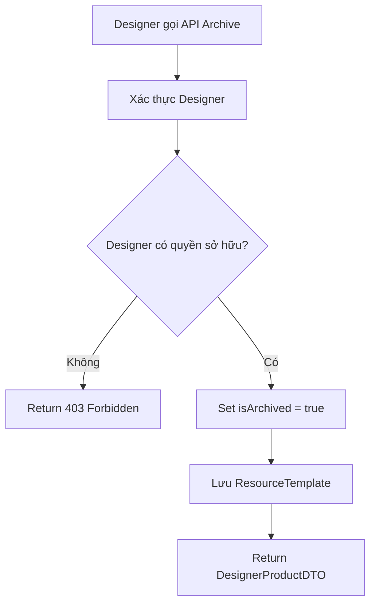
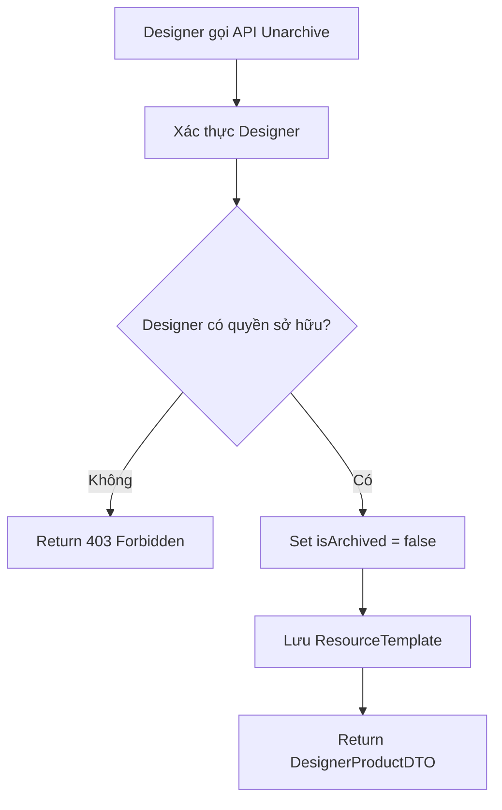
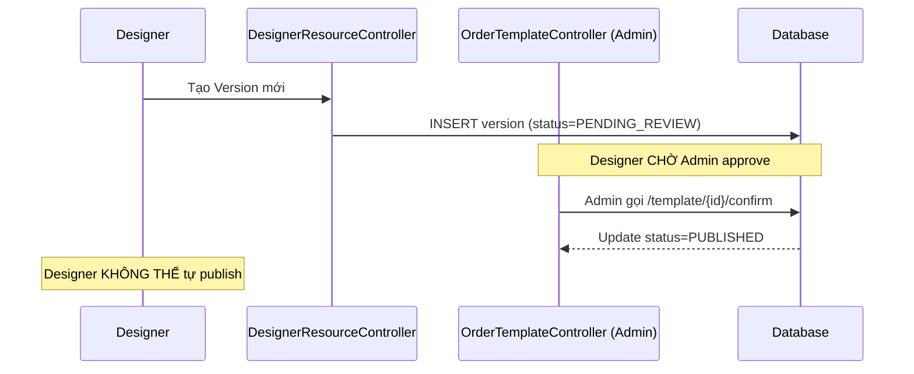

# Phân Tích Logic: Designer Resource Controller

## 📋 Tổng Quan

Document này phân tích chi tiết logic của `DesignerResourceController`, tập trung vào các chức năng quản lý sản phẩm (Resource Template) của Designer, bao gồm:
- ✅ Chức năng Archive/Unarchive
- ✅ Quản lý Versions
- ❌ Chức năng chọn Version để Publish (THIẾU)

---

## 🏗️ Kiến Trúc Hệ Thống

### Các Component Chính

```
DesignerResourceController
    ↓
DesignerResourceService (Interface)
    ↓
DesignerResourceServiceImpl (Implementation)
    ↓
ResourceTemplateRepository & ResourceTemplateVersionRepository
    ↓
Database (resource_template, resource_template_version)
```

### Entities Liên Quan

1. **ResourceTemplate** (Sản phẩm chính)
   - `templateId`: ID của sản phẩm
   - `designerId`: Designer sở hữu
   - `name`, `description`, `type`, `price`
   - `status`: PENDING_REVIEW, PUBLISHED, REJECTED
   - **`isArchived`**: Flag để archive sản phẩm (Boolean, default: false)
   - **`currentPublishedVersionId`**: ID của version đang được publish
   - `createdAt`, `updatedAt`

2. **ResourceTemplateVersion** (Các phiên bản của sản phẩm)
   - `versionId`: ID của version
   - `templateId`: Link đến ResourceTemplate
   - `versionNumber`: Số version (1.0, 2.0, ...)
   - `name`, `description`, `type`, `price`
   - `status`: PENDING_REVIEW, PUBLISHED, REJECTED
   - `createdBy`: Designer tạo version
   - `releaseDate`, `expiredTime`
   - `images`: Danh sách ảnh
   - `items`: Danh sách items

---

## 🔄 Luồng Chức Năng Chi Tiết

### 1️⃣ ARCHIVE PRODUCT (Ngừng Bán)

#### API Endpoint
```
POST /api/orders/designer/products/{resourceTemplateId}/archive
```

#### Mục Đích
Designer muốn **ngừng bán** một sản phẩm, khiến sản phẩm không còn hiển thị trên marketplace cho Customer.

#### Logic Flow



#### Code Implementation

**Controller:**
```java
@PostMapping("/{resourceTemplateId}/archive")
public ResponseEntity<ApiResponse<DesignerProductDTO>> archiveProduct(
        @PathVariable Long resourceTemplateId) {
    Long designerId = getCurrentDesignerId();
    DesignerProductDTO product = designerResourceService.archiveProduct(resourceTemplateId, designerId);
    return ResponseEntity.ok(ApiResponse.success(product, "Product archived successfully"));
}
```

**Service:**
```java
@Override
public DesignerProductDTO archiveProduct(Long resourceTemplateId, Long designerId) {
    // 1. Tìm sản phẩm
    ResourceTemplate template = resourceTemplateRepository.findById(resourceTemplateId)
            .orElseThrow(() -> new ResponseStatusException(HttpStatus.NOT_FOUND, "Product not found"));

    // 2. Kiểm tra quyền sở hữu
    if (!template.getDesignerId().equals(designerId)) {
        throw new ResponseStatusException(HttpStatus.FORBIDDEN, 
            "You don't have permission to archive this product");
    }

    // 3. Set flag archive
    template.setIsArchived(true);
    ResourceTemplate updated = resourceTemplateRepository.save(template);

    // 4. Log và return
    log.info("Archived product {} by designer {}", resourceTemplateId, designerId);
    return convertToProductDTO(updated, designerId);
}
```

#### Các Trường Hợp (Edge Cases)

| Trường Hợp | Kết Quả | Trạng Thái HTTP |
|------------|---------|-----------------|
| ✅ Designer sở hữu sản phẩm | Archive thành công | 200 OK |
| ❌ Designer không sở hữu | Từ chối | 403 Forbidden |
| ❌ Sản phẩm không tồn tại | Không tìm thấy | 404 Not Found |
| ✅ Sản phẩm đã archive trước đó | Archive lại (idempotent) | 200 OK |
| ✅ Sản phẩm có nhiều versions | Archive tất cả versions | 200 OK |

#### Ảnh Hưởng Đến Customer

**HIỆN TẠI - ⚠️ VẤN ĐỀ PHÁT HIỆN:**

Các API Customer query sản phẩm **KHÔNG** filter theo `isArchived`:

```java
// TemplateServiceImpl.java
public PagedResponseDTO<ResourceTemplateDTO> getAllActiveTemplates(...) {
    // ❌ THIẾU: Không filter isArchived = false
    Page<ResourceTemplate> templatePage = resourceTemplateRepository.findByStatus(
        ResourceTemplate.TemplateStatus.PUBLISHED, pageable);
    // ...
}
```

**Repository queries cũng thiếu filter:**
```java
// ResourceTemplateRepository.java
Page<ResourceTemplate> findByStatus(ResourceTemplate.TemplateStatus status, Pageable pageable);
// ❌ Không có isArchived trong điều kiện
```

#### 🔴 BUG PHÁT HIỆN:
**Sản phẩm đã archive vẫn hiển thị cho Customer nếu status = PUBLISHED**

---

### 2️⃣ UNARCHIVE PRODUCT (Bán Lại)

#### API Endpoint
```
POST /api/orders/designer/products/{resourceTemplateId}/unarchive
```

#### Mục Đích
Designer muốn **bán lại** sản phẩm đã archive trước đó.

#### Logic Flow



#### Code Implementation

```java
@Override
public DesignerProductDTO unarchiveProduct(Long resourceTemplateId, Long designerId) {
    // 1. Tìm sản phẩm
    ResourceTemplate template = resourceTemplateRepository.findById(resourceTemplateId)
            .orElseThrow(() -> new ResponseStatusException(HttpStatus.NOT_FOUND, "Product not found"));

    // 2. Kiểm tra quyền sở hữu
    if (!template.getDesignerId().equals(designerId)) {
        throw new ResponseStatusException(HttpStatus.FORBIDDEN, 
            "You don't have permission to unarchive this product");
    }

    // 3. Bỏ flag archive
    template.setIsArchived(false);
    ResourceTemplate updated = resourceTemplateRepository.save(template);

    // 4. Log và return
    log.info("Unarchived product {} by designer {}", resourceTemplateId, designerId);
    return convertToProductDTO(updated, designerId);
}
```

#### Các Trường Hợp

| Trường Hợp | Kết Quả | Trạng Thái HTTP |
|------------|---------|-----------------|
| ✅ Sản phẩm đã archive | Unarchive thành công | 200 OK |
| ✅ Sản phẩm chưa archive | Unarchive (idempotent) | 200 OK |
| ❌ Designer không sở hữu | Từ chối | 403 Forbidden |
| ❌ Sản phẩm không tồn tại | Không tìm thấy | 404 Not Found |
| ⚠️ Sản phẩm status = REJECTED | Unarchive nhưng vẫn REJECTED | 200 OK (cần review lại) |

---

### 3️⃣ VERSION MANAGEMENT

#### Lifecycle của Version

```
PENDING_REVIEW → (Admin Approve) → PUBLISHED
       ↓
   (Admin Reject)
       ↓
   REJECTED
```

#### API Quản Lý Version

##### 3.1 Tạo Version Mới
```
POST /api/orders/designer/products/{resourceTemplateId}/versions
```

**Logic:**
1. Tính version number tiếp theo (v1.0, v2.0, ...)
2. Tạo version với status = PENDING_REVIEW
3. Gán images, items từ DTO
4. Lưu vào database

**Ràng buộc:**
- `name`, `price`, `releaseDate` là bắt buộc
- `releaseDate >= today`
- `expiredTime > releaseDate` (nếu có)

##### 3.2 Cập Nhật Version
```
PUT /api/orders/designer/products/versions/{versionId}
```

**Điều kiện:**
- Chỉ cập nhật được version có status = PENDING_REVIEW
- Designer phải là người tạo version

##### 3.3 Xóa Version
```
DELETE /api/orders/designer/products/versions/{versionId}
```

**Điều kiện:**
- Chỉ xóa được version có status = PENDING_REVIEW
- Designer phải là người tạo version

##### 3.4 Republish Version
```
POST /api/orders/designer/products/versions/{versionId}/republish
```

**Mục đích:** Resubmit version sau khi fix feedback từ Admin

**⚠️ VẤN ĐỀ:**
```java
// Hiện tại logic này không làm gì cả
version.setStatus(ResourceTemplate.TemplateStatus.PENDING_REVIEW); 
// Version đã là PENDING_REVIEW rồi, set lại thành PENDING_REVIEW không có ý nghĩa
```

---

## ❌ CHỨC NĂNG THIẾU: PUBLISH VERSION

### Vấn Đề Hiện Tại

**KHÔNG CÓ API** cho Designer chọn một version cụ thể để publish. Hiện tại:

1. Designer tạo version → Status = PENDING_REVIEW
2. Admin approve → Status = PUBLISHED (qua OrderTemplateController)
3. **Designer KHÔNG THỂ tự chọn version nào để publish**

### Phân Tích Workflow Hiện Tại



### API Admin Approve (Tham Khảo)

```java
// OrderTemplateController.java
@PostMapping("/{id}/confirm")
public ResponseEntity<ApiResponse<ResourceTemplateDTO>> confirmTemplate(@PathVariable Long id) {
    // TODO: Add staff role check here
    ResourceTemplateDTO confirmed = templateService.confirmTemplate(id);
    return ResponseEntity.ok(ApiResponse.success(confirmed, "Template confirmed and published"));
}
```

### 🔧 Đề Xuất: Thêm API Publish Version

#### Option 1: Designer Tự Publish Version (Sau khi Admin Approved)

```java
/**
 * Publish một version đã được approve
 * POST /api/orders/designer/products/versions/{versionId}/publish
 */
@PostMapping("/versions/{versionId}/publish")
public ResponseEntity<ApiResponse<DesignerProductDTO>> publishVersion(
        @PathVariable Long versionId) {
    
    Long designerId = getCurrentDesignerId();
    DesignerProductDTO product = designerResourceService.publishVersion(versionId, designerId);
    
    return ResponseEntity.ok(ApiResponse.success(product, "Version published successfully"));
}
```

**Logic:**
1. Kiểm tra version có status = PUBLISHED (đã được Admin approve)
2. Update `ResourceTemplate.currentPublishedVersionId = versionId`
3. Unpublish các version khác (nếu cần)
4. Return DesignerProductDTO

#### Option 2: Auto-Publish Khi Admin Approve

```java
// TemplateServiceImpl.java
public ResourceTemplateDTO confirmTemplate(Long id) {
    ResourceTemplate template = resourceTemplateRepository.findById(id)
        .orElseThrow(...);
    
    template.setStatus(ResourceTemplate.TemplateStatus.PUBLISHED);
    
    // ✅ THÊM: Auto-set currentPublishedVersionId
    Optional<ResourceTemplateVersion> latestVersion = 
        versionRepository.findLastVersionByTemplateId(id);
    latestVersion.ifPresent(v -> {
        v.setStatus(ResourceTemplate.TemplateStatus.PUBLISHED);
        template.setCurrentPublishedVersionId(v.getVersionId());
    });
    
    return orderMapper.toDto(resourceTemplateRepository.save(template));
}
```

---

## 📊 Luồng Dữ Liệu Tổng Thể

### Trạng Thái Sản Phẩm

```
┌─────────────────────────────────────────────────────────────┐
│ ResourceTemplate                                            │
├─────────────────────────────────────────────────────────────┤
│ - status: PENDING_REVIEW / PUBLISHED / REJECTED            │
│ - isArchived: true / false                                 │
│ - currentPublishedVersionId: Long (nullable)               │
└─────────────────────────────────────────────────────────────┘
                         │
                         │ 1:N
                         ▼
┌─────────────────────────────────────────────────────────────┐
│ ResourceTemplateVersion                                     │
├─────────────────────────────────────────────────────────────┤
│ - versionNumber: 1.0, 2.0, 3.0, ...                        │
│ - status: PENDING_REVIEW / PUBLISHED / REJECTED            │
└─────────────────────────────────────────────────────────────┘
```

### Ma Trận Trạng Thái

| Template Status | isArchived | currentPublishedVersionId | Hiển thị cho Customer? |
|----------------|------------|---------------------------|------------------------|
| PENDING_REVIEW | false      | null                      | ❌ Không               |
| PENDING_REVIEW | true       | null                      | ❌ Không               |
| PUBLISHED      | false      | null                      | ⚠️ **BUG: Có (sai)**   |
| PUBLISHED      | false      | 123                       | ✅ Có                  |
| PUBLISHED      | true       | 123                       | ❌ **BUG: Có (sai)**   |
| REJECTED       | false      | null                      | ❌ Không               |

---

## 🐛 Các Vấn Đề Đã Phát Hiện

### 1. ⚠️ BUG NGHIÊM TRỌNG: Filter isArchived Bị Thiếu

**Vị trí:** `TemplateServiceImpl.getAllActiveTemplates()`

**Mô tả:** Customer vẫn thấy sản phẩm đã archive nếu status = PUBLISHED

**Cách sửa:**
```java
// ResourceTemplateRepository.java
@Query("SELECT rt FROM ResourceTemplate rt " +
       "WHERE rt.status = :status AND rt.isArchived = false")
Page<ResourceTemplate> findActiveByStatus(
    @Param("status") ResourceTemplate.TemplateStatus status, 
    Pageable pageable
);
```

### 2. ❌ THIẾU CHỨC NĂNG: API Publish Version

**Mô tả:** Designer không thể chọn version nào để publish

**Giải pháp:** Thêm API `/versions/{versionId}/publish` (xem phần đề xuất ở trên)

### 3. ⚠️ Logic Republish Không Rõ Ràng

**Vị trí:** `republishVersion()`

**Vấn đề:** 
```java
version.setStatus(ResourceTemplate.TemplateStatus.PENDING_REVIEW); 
// Version đã PENDING_REVIEW, set lại không thay đổi gì
```

**Gợi ý:** Có thể cần:
- Thêm timestamp `resubmittedAt`
- Gửi notification cho Admin
- Reset review comments

### 4. ⚠️ Không Validate Archive-Unarchive Cycle

**Vấn đề:** Designer có thể archive/unarchive liên tục mà không giới hạn

**Gợi ý:** Thêm:
- Rate limiting
- Log history archive/unarchive
- Business rule: Chỉ unarchive nếu có version PUBLISHED

---

## 🔐 Bảo Mật & Phân Quyền

### Kiểm Tra Quyền Hiện Tại

```java
private Long getCurrentDesignerId() {
    ApiResponse<UserResponse> apiResponse = identityClient.getCurrentUser();
    UserResponse user = apiResponse.getResult();
    
    // 1. Kiểm tra user authenticated
    if (user == null || user.getId() == null) {
        throw new ResponseStatusException(HttpStatus.UNAUTHORIZED, 
            "User not authenticated");
    }
    
    // 2. Kiểm tra role = DESIGNER
    if (!"DESIGNER".equalsIgnoreCase(user.getRole())) {
        throw new ResponseStatusException(HttpStatus.FORBIDDEN, 
            "Only designers can access this resource");
    }
    
    return user.getId();
}
```

### Kiểm Tra Ownership

Tất cả các API đều kiểm tra:
```java
if (!template.getDesignerId().equals(designerId)) {
    throw new ResponseStatusException(HttpStatus.FORBIDDEN, 
        "You don't have permission to ...");
}
```

✅ **Bảo mật tốt**, không có vấn đề lớn

---

## 📝 Tổng Kết & Khuyến Nghị

### ✅ Những gì đang hoạt động tốt

1. ✅ Archive/Unarchive logic đơn giản, rõ ràng
2. ✅ Version management đầy đủ (create, update, delete)
3. ✅ Phân quyền chặt chẽ (ownership check)
4. ✅ Idempotent operations (archive nhiều lần không lỗi)

### ❌ Những gì cần sửa ngay

1. 🔴 **CRITICAL:** Thêm filter `isArchived = false` trong tất cả customer queries
2. 🔴 **HIGH:** Implement API để Designer publish version
3. 🟡 **MEDIUM:** Fix logic `republishVersion()` 
4. 🟡 **MEDIUM:** Thêm validation cho archive/unarchive cycle

### 🚀 Đề Xuất Cải Tiến

#### 1. Thêm Status Tracking

```java
@Entity
public class ResourceTemplate {
    // ...
    
    @Column(name = "archived_at")
    private LocalDateTime archivedAt;
    
    @Column(name = "archived_by")
    private Long archivedBy;
}
```

#### 2. Version History

```java
@Entity
public class ResourceTemplateVersionHistory {
    private Long id;
    private Long versionId;
    private String action; // CREATED, UPDATED, PUBLISHED, REJECTED
    private Long performedBy;
    private LocalDateTime performedAt;
    private String notes;
}
```

#### 3. Soft Delete cho Versions

```java
@Entity
public class ResourceTemplateVersion {
    // ...
    
    @Column(name = "deleted_at")
    private LocalDateTime deletedAt;
    
    @Column(name = "deleted_by")
    private Long deletedBy;
}
```

---

## 📚 API Reference Summary

### Designer Product Management

| Endpoint | Method | Mục Đích | Status |
|----------|--------|----------|--------|
| `/designer/products` | GET | Lấy danh sách sản phẩm | ✅ OK |
| `/designer/products/{id}` | GET | Chi tiết sản phẩm | ✅ OK |
| `/designer/products/{id}/archive` | POST | Archive sản phẩm | ✅ OK |
| `/designer/products/{id}/unarchive` | POST | Unarchive sản phẩm | ✅ OK |

### Version Management

| Endpoint | Method | Mục Đích | Status |
|----------|--------|----------|--------|
| `/designer/products/{id}/versions` | GET | Danh sách versions | ✅ OK |
| `/designer/products/{id}/versions` | POST | Tạo version mới | ✅ OK |
| `/designer/products/versions/{id}` | GET | Chi tiết version | ✅ OK |
| `/designer/products/versions/{id}` | PUT | Cập nhật version | ✅ OK |
| `/designer/products/versions/{id}` | DELETE | Xóa version | ✅ OK |
| `/designer/products/versions/{id}/republish` | POST | Republish version | ⚠️ Cần fix |
| `/designer/products/versions/{id}/publish` | POST | **Publish version** | ❌ **THIẾU** |

---

## 🔍 Code Review Checklist

- [ ] Filter `isArchived = false` trong customer queries
- [ ] Implement API publish version
- [ ] Fix logic republish version
- [ ] Thêm validation archive/unarchive
- [ ] Thêm audit log cho archive/unarchive
- [ ] Unit tests cho archive/unarchive
- [ ] Integration tests cho publish version
- [ ] Documentation API swagger
- [ ] Review business rules với Product Owner

---

**Ngày tạo:** 2025-12-07  
**Người phân tích:** GitHub Copilot  
**Version:** 1.0
