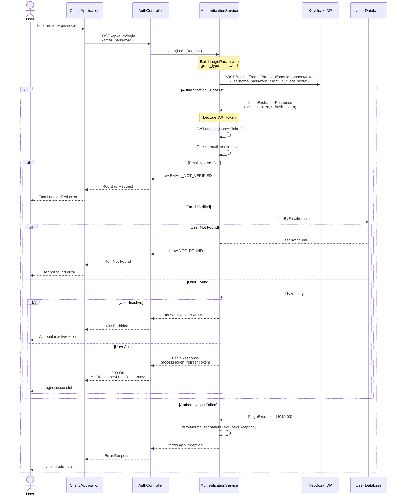
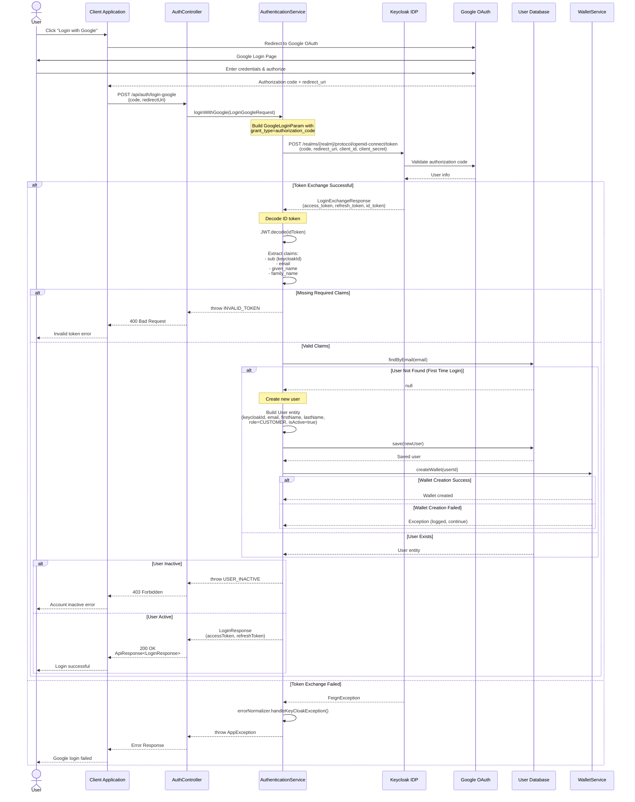
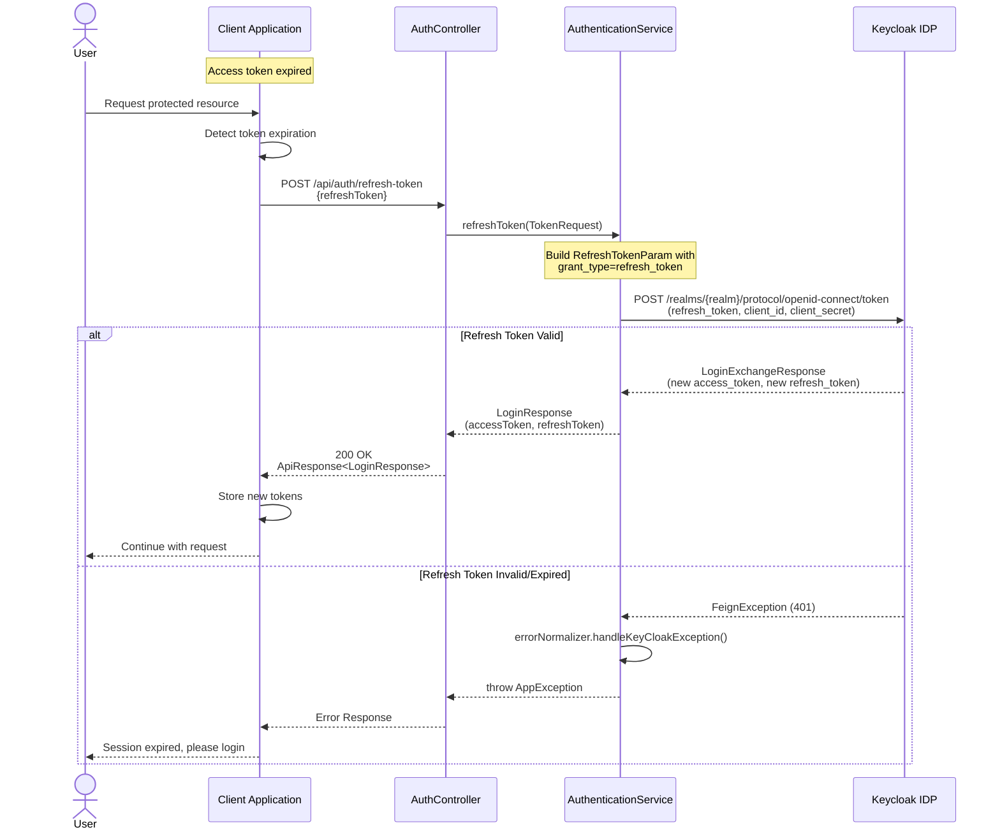

# Login Sequence Diagram - Identity Service

This document contains sequence diagrams for the login flows in the SketchNote Identity Service.

## 1. Standard Login Flow (Email/Password)

## 2. Google OAuth Login Flow

## 3. Refresh Token Flow

## Key Components

### Controllers
- **AuthController**: REST API endpoints for authentication operations

### Services
- **AuthenticationService**: Business logic for authentication
- **ErrorNormalizer**: Handles Keycloak exceptions and converts to AppExceptions
- **WalletService**: Creates wallet for new users (Google OAuth)

### External Systems
- **Keycloak**: Identity Provider (IDP) for authentication and user management
- **Google OAuth**: Third-party authentication provider

### Data Models
- **User**: User entity stored in application database
- **LoginRequest**: Email and password for standard login
- **LoginGoogleRequest**: Authorization code and redirect URI for Google OAuth
- **LoginResponse**: Contains access_token and refresh_token
- **TokenRequest**: Contains refresh_token for token refresh

### Security Validations
1. Email verification check (standard login)
2. User existence check
3. User active status check
4. JWT token validation
5. Required claims validation (Google OAuth)

### Error Handling
- `EMAIL_NOT_VERIFIED`: Email not verified in Keycloak
- `NOT_FOUND`: User not found in database
- `USER_INACTIVE`: User account is inactive
- `INVALID_TOKEN`: Invalid or missing JWT claims
- `FeignException`: Keycloak API errors (handled by ErrorNormalizer)
