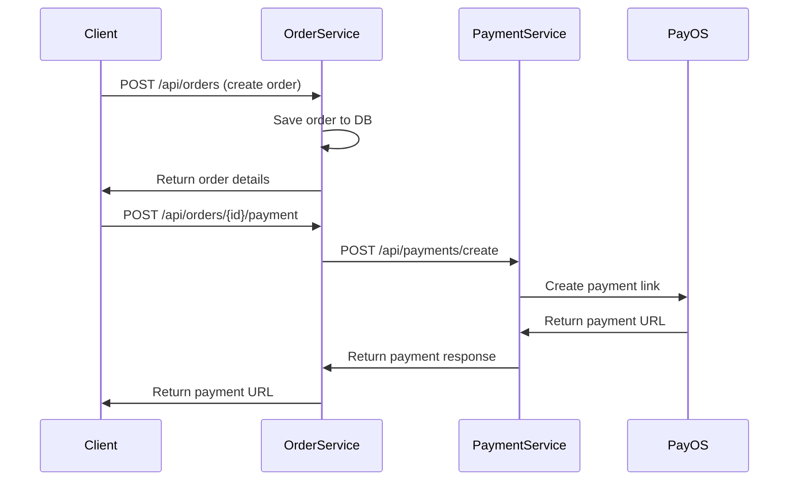
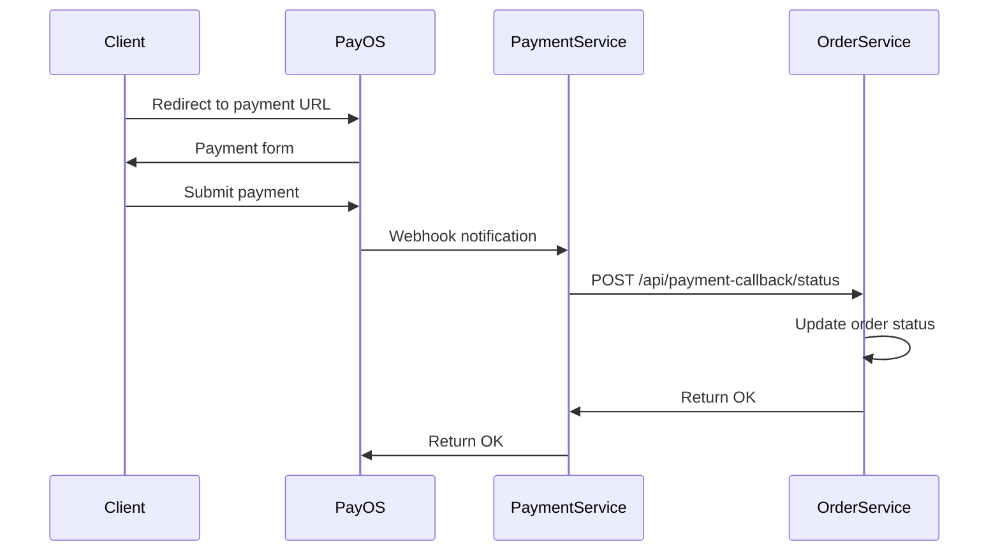

# Microservice Integration Documentation

## Tổng quan
Order Service được tích hợp với Payment Service thông qua microservice architecture. Order Service gọi Payment Service để xử lý thanh toán và nhận callback để cập nhật trạng thái order.

## Architecture

```
Frontend → Order Service → Payment Service → PayOS
    ↑                           ↓
    └─── Callback ←─────────────┘
```

## Configuration

### Environment Variables
```bash
PAYMENT_SERVICE_URL=http://localhost:8081
APP_BASE_URL=http://localhost:8080
```

### application.yml
```yaml
payment-service:
  url: ${PAYMENT_SERVICE_URL:http://localhost:8081}

app:
  base-url: ${APP_BASE_URL:http://localhost:8080}
```

## PaymentClient

### Interface
```java
@Component
public class PaymentClient {
    PaymentResponseDTO createPaymentLink(PaymentRequestDTO paymentRequest);
    PaymentResponseDTO getPaymentStatus(String orderCode);
    boolean cancelPaymentLink(String orderCode);
}
```

### Endpoints gọi đến Payment Service
- `POST {payment-service-url}/api/payments/create`
- `GET {payment-service-url}/api/payments/status/{orderCode}`
- `POST {payment-service-url}/api/payments/cancel/{orderCode}`

## OrderPaymentService

### Interface
```java
public interface OrderPaymentService {
    PaymentResponseDTO createPaymentForOrder(Long orderId);
    PaymentResponseDTO getOrderPaymentStatus(Long orderId);
    boolean cancelOrderPayment(Long orderId);
    void handlePaymentCallback(Long orderId, String paymentStatus);
}
```

### Responsibilities
- Tạo payment request từ order data
- Gọi PaymentClient để tương tác với Payment Service
- Xử lý callback từ Payment Service
- Cập nhật trạng thái order dựa trên payment status

## API Endpoints

### Order Payment Endpoints

#### 1. Tạo Payment Link cho Order
```http
POST /api/orders/{orderId}/payment
```

**Response:**
```json
{
  "paymentId": "payment-123",
  "orderCode": "1234567890",
  "amount": 25.00,
  "description": "Payment for Order #INV-A1B2C3D4",
  "paymentUrl": "https://pay.payos.vn/web/...",
  "status": "PENDING",
  "createdAt": "2024-01-15T10:30:00",
  "expiredAt": "2024-01-15T10:45:00"
}
```

#### 2. Kiểm tra Payment Status
```http
GET /api/orders/{orderId}/payment-status
```

#### 3. Hủy Payment
```http
POST /api/orders/{orderId}/cancel-payment
```

### Callback Endpoints

#### 1. Payment Callback
```http
POST /api/payment-callback/status
```

**Request Body:**
```json
{
  "orderId": 1,
  "orderCode": "1234567890",
  "paymentId": "payment-123",
  "amount": 25.00,
  "status": "PAID",
  "description": "Payment successful",
  "paymentTime": "2024-01-15T10:30:00",
  "transactionId": "txn-123"
}
```

#### 2. Health Check
```http
GET /api/payment-callback/health
```

## Payment Flow

### 1. Tạo Order và Payment


### 2. Payment Processing và Callback


## DTOs

### PaymentRequestDTO
```json
{
  "orderId": 1,
  "amount": 25.00,
  "description": "Payment for Order #INV-A1B2C3D4",
  "returnUrl": "http://localhost:3000/payment/success",
  "cancelUrl": "http://localhost:3000/payment/cancel",
  "items": [
    {
      "name": "Business Presentation Template",
      "quantity": 1,
      "price": 25.00
    }
  ]
}
```

### PaymentResponseDTO
```json
{
  "paymentId": "payment-123",
  "orderCode": "1234567890",
  "amount": 25.00,
  "description": "Payment for Order #INV-A1B2C3D4",
  "paymentUrl": "https://pay.payos.vn/web/...",
  "status": "PENDING",
  "createdAt": "2024-01-15T10:30:00",
  "expiredAt": "2024-01-15T10:45:00"
}
```

### PaymentCallbackDTO
```json
{
  "orderId": 1,
  "orderCode": "1234567890",
  "paymentId": "payment-123",
  "amount": 25.00,
  "status": "PAID",
  "description": "Payment successful",
  "paymentTime": "2024-01-15T10:30:00",
  "transactionId": "txn-123"
}
```

## Error Handling

### Payment Service Unavailable
```json
{
  "timestamp": "2024-01-15T10:30:00",
  "status": 503,
  "error": "Service Unavailable",
  "message": "Payment service is not available",
  "path": "/api/orders/1/payment"
}
```

### Order Not Found
```json
{
  "timestamp": "2024-01-15T10:30:00",
  "status": 404,
  "error": "Not Found",
  "message": "Order not found with id: 999",
  "path": "/api/orders/999/payment"
}
```

## Order Status Mapping

| Payment Status | Order Status | Payment Status |
|---------------|--------------|----------------|
| PENDING       | PENDING      | PENDING        |
| PAID          | CONFIRMED    | PAID           |
| FAILED        | CANCELLED    | FAILED         |
| CANCELLED     | CANCELLED    | CANCELLED      |

## Testing

### Test Payment Creation
```bash
# 1. Create order
curl -X POST http://localhost:8080/api/orders \
  -H "Content-Type: application/json" \
  -d '{
    "userId": 1,
    "items": [
      {
        "resourceTemplateId": 1,
        "discount": 0
      }
    ]
  }'

# 2. Create payment for order
curl -X POST http://localhost:8080/api/orders/1/payment \
  -H "Content-Type: application/json"
```

### Test Payment Callback
```bash
curl -X POST http://localhost:8080/api/payment-callback/status \
  -H "Content-Type: application/json" \
  -d '{
    "orderId": 1,
    "orderCode": "1234567890",
    "paymentId": "payment-123",
    "amount": 25.00,
    "status": "PAID",
    "description": "Payment successful",
    "paymentTime": "2024-01-15T10:30:00",
    "transactionId": "txn-123"
  }'
```

## Monitoring & Logging

### Key Log Messages
- Payment link creation: `Payment link created for order {orderId}: {paymentUrl}`
- Payment callback: `Received payment callback for order {orderId}: status={status}`
- Order status update: `Order {orderId} confirmed after successful payment`
- Error handling: `Error creating payment link for order {orderId}: {error}`

### Metrics to Monitor
- Payment creation success rate
- Payment callback processing time
- Order status update success rate
- Payment service availability

## Security Considerations

1. **Service Communication**: Sử dụng HTTPS cho communication giữa services
2. **Callback Verification**: Verify callback signature từ Payment Service
3. **Order Code Mapping**: Secure mapping giữa orderId và orderCode
4. **Error Handling**: Không expose sensitive payment information trong error messages

## Deployment

### Service Discovery
- Sử dụng Eureka hoặc Consul cho service discovery
- Configure load balancing cho Payment Service
- Health check endpoints cho monitoring

### Environment Configuration
```bash
# Development
PAYMENT_SERVICE_URL=http://localhost:8081

# Production
PAYMENT_SERVICE_URL=https://payment-service.sketchnotes.com
```

## Troubleshooting

### Common Issues

1. **Payment Service Unavailable**
   - Check Payment Service health
   - Verify network connectivity
   - Check service discovery configuration

2. **Callback Not Received**
   - Verify callback URL configuration
   - Check Payment Service logs
   - Ensure Order Service is accessible

3. **Order Status Not Updated**
   - Check callback processing logs
   - Verify orderId mapping
   - Check database transaction logs
