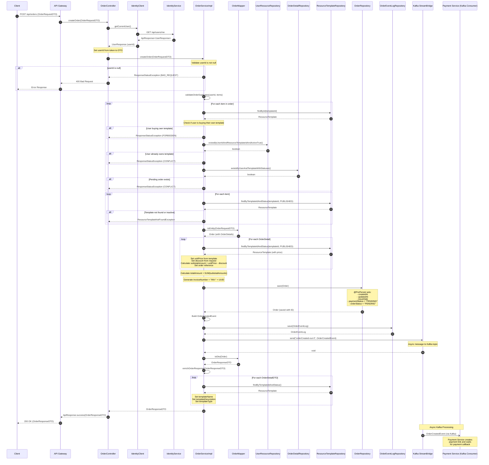
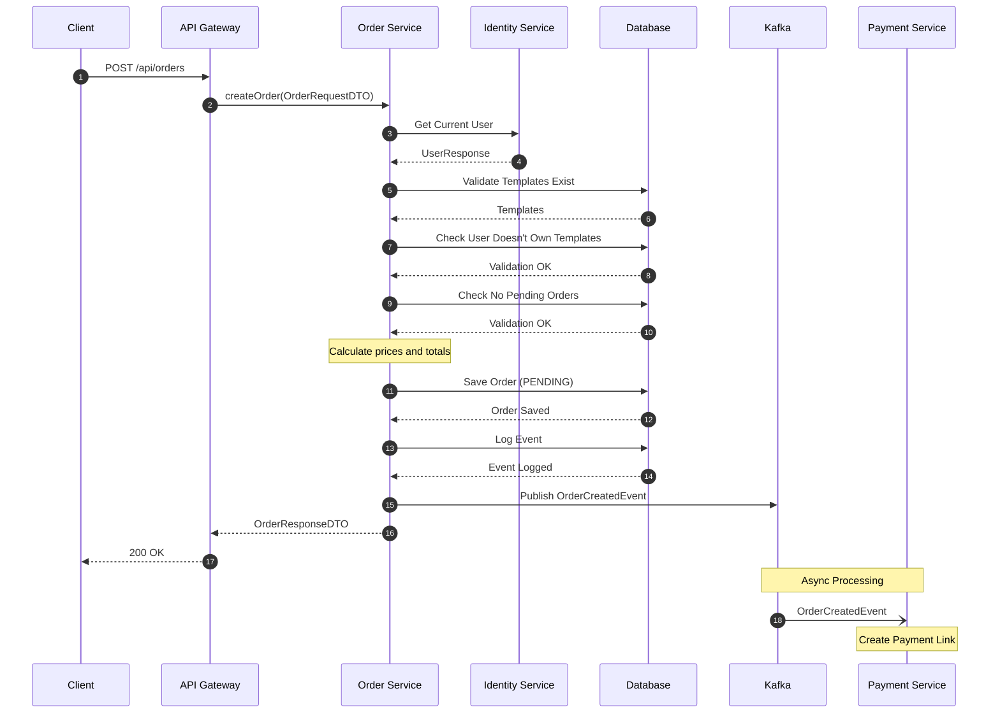

# Create Order Sequence Diagram

## Mermaid Diagram for Draw.io



## Simplified Version (Without Internal Details)



## Data Flow

### OrderRequestDTO
```json
{
    "userId": null,  // Set by controller from JWT token
    "subscriptionId": null,  // Optional
    "items": [
        {
            "resourceTemplateId": 1,
            "discount": 0.00  // Optional
        }
    ]
}
```

### OrderCreatedEvent (Kafka)
```json
{
    "orderId": 123,
    "userId": 456,
    "totalAmount": 100.00,
    "items": [
        {
            "resourceTemplateId": 1,
            "price": 100.00,
            "discount": 0.00
        }
    ]
}
```

### OrderResponseDTO
```json
{
    "orderId": 123,
    "userId": 456,
    "totalAmount": 100.00,
    "paymentStatus": "PENDING",
    "orderStatus": "PENDING",
    "invoiceNumber": "INV-A1B2C3D4",
    "issueDate": "2025-12-02T10:00:00",
    "items": [
        {
            "orderDetailId": 1,
            "resourceTemplateId": 1,
            "unitPrice": 100.00,
            "discount": 0.00,
            "subtotalAmount": 100.00,
            "templateName": "Template Name",
            "templateDescription": "Description",
            "templateType": "STICKER"
        }
    ]
}
```

## Key Components

| Component | Responsibility |
|-----------|---------------|
| OrderController | Handle HTTP request, get user from token |
| IdentityClient | Feign client to Identity Service |
| OrderServiceImpl | Business logic, validation, event publishing |
| OrderMapper | DTO <-> Entity conversion |
| ResourceTemplateRepository | Access template data |
| UserResourceRepository | Check user ownership |
| OrderDetailRepository | Check pending orders |
| OrderRepository | Persist orders |
| StreamBridge | Publish Kafka events |
| Payment Service | Handle payment asynchronously |

## Validation Rules

1. **User ID Required**: Must have authenticated user
2. **Cannot Buy Own Template**: Designer cannot purchase their own template
3. **No Duplicate Ownership**: User cannot buy template they already own
4. **No Pending Orders**: User cannot have multiple pending orders for same template
5. **Template Must Be Active**: Template status must be PUBLISHED
